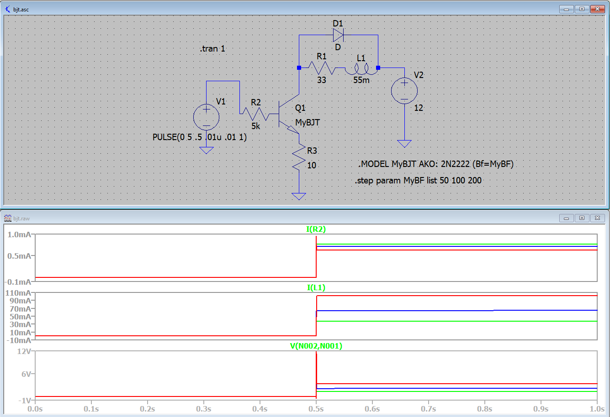

# やりたいこと

ソレノイド（33Ω, 55mH：値は参考値）に12V、100mAの電流を流したい。

# FETでのドライブ回路
最初FETを使ったこういう回路を考えた。


図1

図2の回路（上記からソレノイドを外した回路）を組んでドレイン電流IDを測定してみたところ、Vgsがしきい値(図中のSIGNALが約2.0V)でのドレイン電流の下限が160mAとなり、仕様の100mAを超えてしまうことになった。

計測時の動画：[https://youtu.be/DnDlUWIpxpg](https://youtu.be/DnDlUWIpxpg)


図2

よって図3のように電流制限抵抗をソレノイドに直列に入れることを考えたが、これだと分圧が発生してソレノイドの端子間電圧が降下してしまう。おまけに気づいたのが、そもそもソレノイドにある抵抗分（33Ω）があるので、図2で160mAのドレイン電流が流れるときのソレノイドの端子間電圧はV=IR=ID x R=0.16 x 33=5.28[V]となり、12Vの端子間電圧にならないのではないか。　


図3

ここまでの議論をLTspiceのシミュレーションで確認する。
BS170のSPICEモデルを動かすのが難しかったので、類似の2N7002を使ってシミュレーションしてみる。
入力電圧（SIGNAL）として3.15Vを与えると、160mA程度のドレイン電流が流れた。
（*追記：以下では仕様の100mAを***160mA***だと勘違いして議論を進めている。適宜読み替えること*）


図4

さて、この回路にソレノイドを挿入してみる。
コイルの両端に流れるドレイン電流は160mAとなり、FETのドレイン電流IDが問題なく流れているのでOK。


図5

問題は端子間電圧である。コイルの両端の端子間電圧は0なので、コイルと抵抗を合わせたソレノイド間の電圧を測定する。図6のV(V1,Vd)（緑）がソレノイドの端子間電圧、V(Vd)（青）がドレイン＝ソース間電圧Vdsを表す。FETがONになると、ソレノイド端子間電圧は5.5V程度、ドレイン＝ソース間電圧は6.5V程度となり、合計すると12Vとなる。つまり、ソレノイドに流れる電流に応じて端子間電圧が決まり(V=IR=160mA*33mΩ=5.28V)、それに応じてドレイン＝ソース間電圧が降下するという仕組みになっている。


図6

# ところで

ソレノイドバルブの表面には12V, 100mAという表示があった。そもそもこの解釈は、電圧かつ電流指定の仕様（＝12V、100mAを流せ）だと思っていた。一方で、ソレノイドの端子間電圧はソレノイド内部抵抗Rと流れる電流Iの2変数で決まる。Rはソレノイドに固有の定数なので変更できず、いまIを100mAとして与えると、電圧が12Vであるためには内部抵抗はR=V/I=12/0.1=120Ωでなければならないはずである。もしこれが正しければ、以下のようなリレーで単純にON/OFFすれば済んでしまう話である。抵抗はテスターで計測できるはずなので、あらためて現物を確認してみることにしよう。


図7

個人的な予想では、内部抵抗Rは120Ωになっていない気がする（120Ωはソレノイドの抵抗値としては大きい値に思える）。この場合、12V, 100mAは電流・電圧の絶対的な値の指定ではなく、消費電力P=IV=1.2Wを与えるための参考値ということではないだろうか。であれば、電源電圧12Vを固定として、内部抵抗RにしたがってP=I^2 R=1.2Wになるような電流値を求め、その電流値を達成するFETのゲート電圧を逆算して求めれば、上記の回路でも動作する気がする。

以下の情報があればさらなる議論が可能になる。

- ソレノイド内部抵抗の測定
- データシートの取得（←そもそもこれが入手できればこんな問題は発生していない気もするが...）

**追記：** なんとソレノイドの抵抗は120Ωだった（実際は123Ωと121.5Ω）。話がいとも簡単になる。リレーではなく、FETで動かすことにする。PWMではなく5VのON/OFF出力。

**追記その２：** 電流の流れる方向を切り替えるため、FETでHブリッジを組む必要がありそう。モジュールで買ったほうが早いので、[L298](https://store.nerokas.co.ke/index.php?route=product/product&product_id=303&search=h+bridge&description=true) というのを買うことにした（1つの基板に２つの組がついていたのも都合が良い）。


# FETからBJTへ
上記では電圧入力（SIGNAL）をPWMで駆動することを考えていた。そもそもPWMでの入力がソレノイドの駆動に適しているのかという問題に気づく。LTspiceでのPWM(5V, duty ratio 3.15(V)/5(V)=0.63, period 20ms)のシミュレーションをしてみた。


図8

最初フリーホイールダイオードを入れずにシミュレーションしたために過大な逆起電力がFETに発生してしまった。図8は電流帰還用のダイオードを入れた修正シミュレーションである。想像していたとおり、PWMの波形にそってソレノイドバルブは間欠的にON/OFFを繰り返しており、厳密には望ましい動作ではない。しかも3.15Vの入力に対応するようにDuty比を0.63としてみたものの、ねらいの160mAではなく340mAが出力されている。結論としてPWMによる駆動は不適である。

したがって分圧抵抗で所望のゲート電圧を作ればよいのでは？と思ったが、ゲート抵抗R1とゲートソース抵抗R2は別の選定理由から決まっているので、この比を自由にいじることはできない。

- [【ゲート駆動回路】ゲート抵抗の設計方法について](https://detail-infomation.com/gate-driver-gate-resistance-design/)
- [プルアップ抵抗・プルダウン抵抗の値の決め方は？（初心者向け）](https://kairo-consulting.com/blog/%E3%83%97%E3%83%AB%E3%82%A2%E3%83%83%E3%83%97%E6%8A%B5%E6%8A%97%E3%83%BB%E3%83%97%E3%83%AB%E3%83%80%E3%82%A6%E3%83%B3%E6%8A%B5%E6%8A%97%E3%81%AE%E5%80%A4%E3%81%AE%E6%B1%BA%E3%82%81%E6%96%B9%E3%81%AF/)
- [MOSFETにゲートソース間抵抗が接続されている理由](https://detail-infomation.com/mosfet-gate-to-source-resistor/)

どうやらPWM＋FETの組み合わせがまずそうなので、BJTでのスイッチングを考えてみる。

# BJTでのスイッチング

調べてみると単純にBJTでスイッチングしている人がいた。

- [ 電磁弁駆動回路 ](https://sites.google.com/site/nekolabwiki/electronic/air_cylinder)

上記のサイトではソレノイドバルブを単なるコイルとしてモデル化しており、直流抵抗が無視されている。直流抵抗を無視してもよいのかという点を確かめるために、１）コイルのみでモデル化、２）コイル＋抵抗でモデル化、という２通りでシミュレーションしてみる。

まず２）の抵抗ありから始める。V1からの出力電圧を5V、ベース抵抗を3.6kΩとすると、コレクタ＝エミッタ電流が165mA程度となった。このときベース＝エミッタ電流は1.2mA程度なので、増幅率は137くらい。ソレノイド端子間の電圧は5.7V程度だが、これは前述の通り直流抵抗R=33mΩによって決まる値である。規定の電流が流れていればよいのであれば、回路はこれでいいんじゃないか？FETに比べた利点は、BJTはFETと異なり電流駆動のため、マイコンからの出力5Vに対して自由にベース抵抗を設定してベース電流をいじれることにある。これはFETにはないバイポーラトランジスタの利点である。これまで無碍に扱ってきたBJTを見直した。


図9

さて、念のため１）の直流抵抗を省いたシミュレーションも行ってみる。結果は以下。


図10

あまり数値は変わっていない。コレクタ＝エミッタ電流が多少増加し、171mAくらい。ベース電流は当然変化なし。またソレノイドの直流抵抗をゼロとおいたため、両端の電位差はゼロとなった。納得できる結果である。したがって、ソレノイドの直流抵抗をゼロとすると多少の電流変動はあるものの、ソレノイドに流れる計算する観点では、あまり大きな誤差ではないといえそうである。上記ではソレノイドの直流抵抗をテスターで確認してみようと言ったが、これぐらいの誤差しか生まないのなら、調べる必要はないかも。

# エミッタ抵抗について
上記の回路ではエミッタ抵抗を挿入していないが、エミッタ抵抗がないと動作点の設定が難しく、安定した動作が保証されない。どういうことか以下で説明する。

まず、エミッタ抵抗をいれない回路について。バイポーラトランジスタの電流増幅率hfe(あるいはβ)は個体差が大きく、ばらつきがある。hfeを50, 100, 200と変えてシミュレーションした結果が図11。

（※hfeをパラメータとして振ってシミュレーションする方法は次のリンクを参考：[How to view and customize beta of a transistor in LTspice](https://electronics.stackexchange.com/a/330949)）

図11ではベース電流は変わっていないが、ドレイン電流が大きく変動してしまっていることがわかる（Ic=β•Ibという定義から明らか）。値を読むと、ベース電流0.84mAに対して43.7mA(β=52), 74.8mA(β=89), 128mA(β=152)。誤差の範囲は128-43.7=84.3mAにもなる。


図11

さて、エミッタ抵抗を挿入するとどのような変化が現れるか？エミッタ抵抗はコレクタ電流の増加に伴ってエミッタ電圧を押し上げるので、それに伴ってVbeが減少するという負帰還の働きをする。たとえば以下のようにエミッタ抵抗として100Ωを挿入すると、バラツキが21mA〜33mA（上限と下限の差は12mA）の範囲内に抑えられていることがわかる。


図12

しかし、図12のシミュレーションではエミッタ電流が設計値の100mAを大きく下回ってしまった。コレクタ電流を上げるためにはベース電流を増やせばいいはずなので、ベース抵抗を下げてやる。


図13

あれっ、ベース抵抗を5kΩから1Ωまで下げてもベース電流が全く上がらない。1mA程度が限界のようである。5Vで1mAのときの抵抗は5kΩだから、5kΩから下に下げてもベース電流が変化しないという結果のようだが、オームの法則から考えてどうなっているのか？（追記：エミッタ抵抗に大きな値を使うとエミッタ電圧Veが上昇してしまい、すなわちベース＝エミッタ電圧Vbeが減少してしまう。これがベース電流Ibの現象をもたらすというからくり→参考：[第8回　エミッタ接地回路にばらつき対策施す](https://eetimes.jp/ee/articles/0910/09/news093.html)）



図14

とりあえずエミッタ抵抗を1/10の10Ωにしてみた。バラツキは増えたが、コレクタ電流は39.62mA, 66.15mA, 104.23mAと、エミッタ抵抗がない場合と比べると、多少バラツキは抑えられている（104.23-39.62=64mA）。エミッタ抵抗の決め方について、やはりソレノイドの直流抵抗を計測して、その抵抗値とのバランスを見ながら決めるのがいいのかな？それとも負荷の抵抗とは独立に決めることができるのか？エミッタ抵抗を持つエミッタ接地回路の出力電圧（コレクタの電圧）は負荷抵抗RLとエミッタ抵抗REの比で決まるので（[はじめての電子回路15講](https://www.kspub.co.jp/book/detail/1565630.html) p.45）、やはり負荷抵抗RLのオーダーを知る必要があるように思える。

# 今後の方向

今後の方向性として、

- まずソレノイドの直流抵抗を計測する
- 直流抵抗が120Ωだったらビンゴ！単純にリレーで駆動すればよい。もしリレーの１次側をマイコンの出力で直接駆動できなかったら、エミッタ接地増幅回路で補助してやる。（追記：ビンゴだった。上記にも書いたとおり、結局出来合いのHブリッジのモジュールを買ってきて使うことにした。）
- 直流抵抗が33Ωとかの異なる値だったら、エミッタ抵抗付きのエミッタ接地増幅回路で駆動してやる。パラメータとしてはベース抵抗とエミッタ抵抗。エミッタ抵抗はなるべく低い値（10Ωとか）に決め、ベース抵抗は所望のベース電流とマイコン出力電圧から計算して決める。

（追記）120Ωだったので、Hブリッジで駆動することにした。下で議論するように、3-way valve（制御すべき状態の数: 3）なので実際はHブリッジモジュール（制御できる状態の数: 2^4=16） は必要なかったが、モジュールが便利なので使っている。

# バルブ制御のシーケンス

バルブから4端子（赤x2、黒x2）がでているため、ソレノイドバルブが有するコイルの数は2個と予想される。4/3 way valveでは4 ports/3 positions、すなわちとりうる状態の数が3である。これは以下の3状態であると予想される。　

- 左側のコイルがON
- 右側のコイルがON
- 両方ともOFF


4/3 wayのバルブ1つでConcentratorを駆動している例を探したところ、以下の文献が該当した。

[Design and implementation of an oxygen concentrator with GPRS-based fault transfer system](https://www.researchgate.net/profile/Ismail_Atacak/publication/322232559_DESIGN_AND_IMPLEMENTATION_OF_AN_OXYGEN_CONCENTRATOR_WITH_GPRS-BASED_FAULT_TRANSFER_SYSTEM/links/5a4cfefba6fdcc3e99d13710/DESIGN-AND-IMPLEMENTATION-OF-AN-OXYGEN-CONCENTRATOR-WITH-GPRS-BASED-FAULT-TRANSFER-SYSTEM.pdf)


上記を参考に組んだ図が以下。


arduinoコードは以下
```

```

ArduinoとHブリッジモジュールの配線


